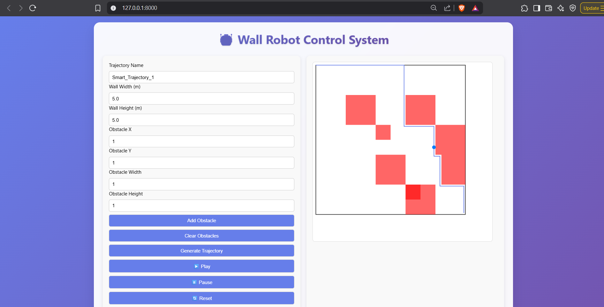

# 🤖 Wall Robot Control System

A smart web-based simulator for generating and visualizing intelligent robot trajectories to cover walls while avoiding obstacles — powered by A* path planning, FastAPI, and Redis-based real-time messaging.

---

## 🧠 Features

- 🔍 **Intelligent Path Planning**  
  Implements A* algorithm to compute optimal wall coverage paths around obstacles.

- 📊 **Canvas-based Visualization**  
  Interactive HTML5 canvas showing the wall, obstacles, and animated trajectory.

- 🔁 **Real-time Communication**  
  Uses Redis Pub/Sub + WebSockets for instant toast notifications on creation and deletion events.

- 📝 **Detailed Logging**  
  All events are logged with timestamps and severity in `robot_system.log`.

- 💾 **Persistent Trajectory Storage**  
  Stores wall configuration, obstacles, and path data in SQLite.

- ⏯️ **Playback Controls**  
  Play, pause, and reset animations of the robot's movement.

---

## 🛠️ Tech Stack

| Layer         | Tech                        |
|---------------|-----------------------------|
| Frontend      | HTML + CSS + JS (vanilla)   |
| Visualization | HTML5 Canvas                |
| Backend       | Python + FastAPI            |
| Path Planning | A* Algorithm                |
| Realtime Comm | Redis + WebSocket           |
| Database      | SQLite                      |
| Logging       | Python `logging` module     |

---

## 📂 Project Structure

```
wall_robot_system/
├── main.py                  # FastAPI backend with Redis + A* logic
├── robot_trajectories.db    # SQLite database
├── robot_system.log         # Log output file
├── static/
│   └── index.html           # Frontend UI with canvas
└── README.md                # You're here
```

---

## 🚀 Getting Started

### 📦 Requirements

- Python 3.8+
- Redis (locally or via Docker)
- Git
- Uvicorn

### 🔧 Setup Instructions

1. **Clone the repo**
   ```bash
   git clone https://github.com/YOUR_USERNAME/wall-robot-control-system.git
   cd wall-robot-control-system
   ```

2. **Install dependencies**
   ```bash
   python -m venv venv
   venv\\Scripts\\activate   # On Windows
   pip install -r requirements.txt
   ```

3. **Run Redis using Docker**
   ```bash
   docker start redis-server  # If it's already created
   # Or create a new one:
   docker run -d -p 6379:6379 --name redis-server redis
   ```

4. **Start FastAPI server**
   ```bash
   uvicorn main:app --reload
   ```

5. **Open in browser**
   ```
   http://localhost:8000
   ```

---

## 🖼️ Screenshots


```

```

---

## 🚧 Future Improvements

- 📍 Real-time robot position broadcasting  
- 🔐 Auth & role-based access  
- 📈 Prometheus + Grafana for monitoring  
- ☁️ Cloud deployment (Railway / Render / Fly.io)  
- 🎯 Smarter path strategies (spiral, S-curve)  

---
